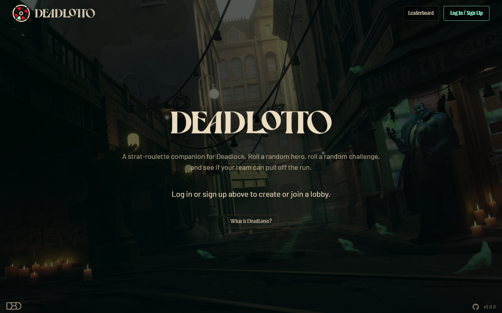
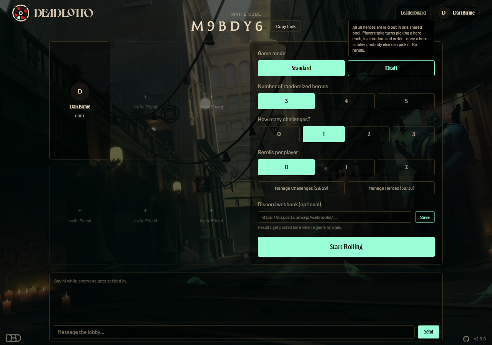
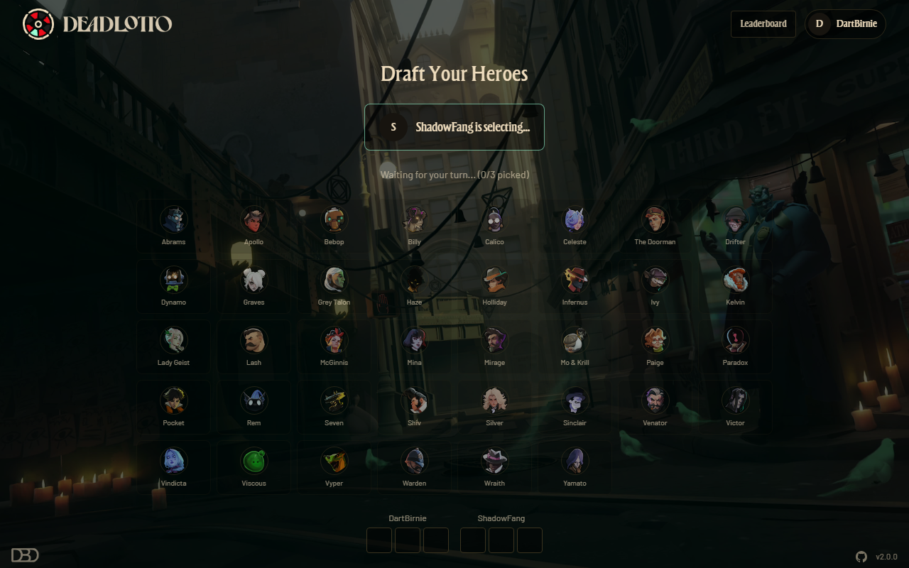
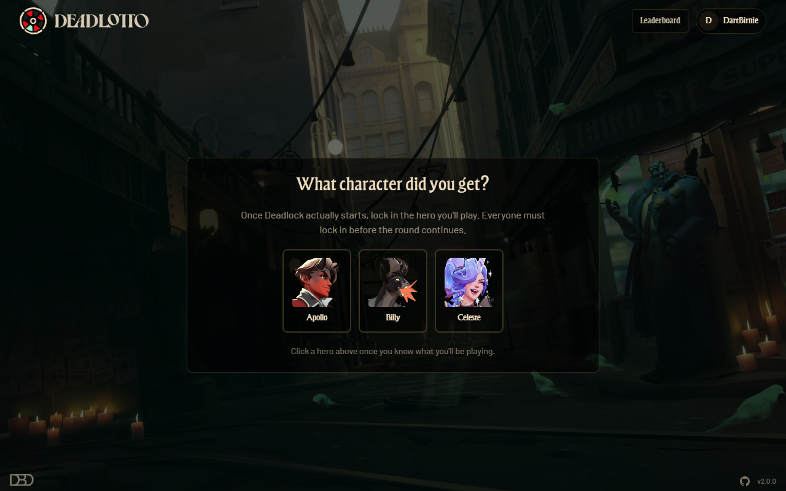
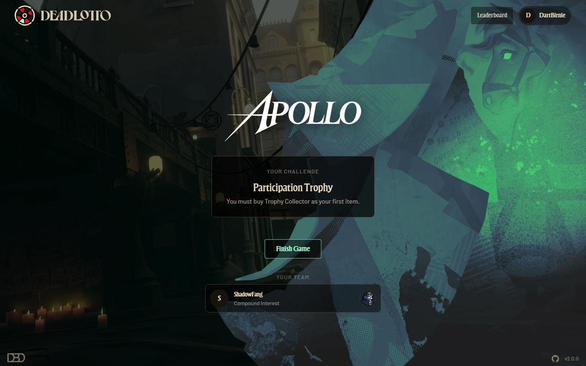
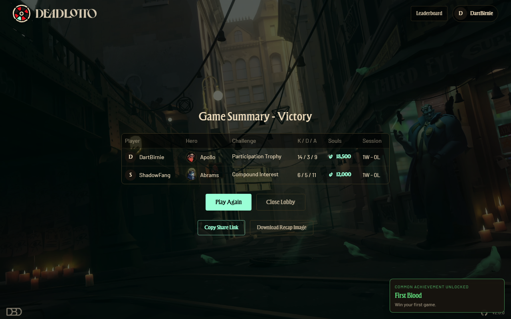
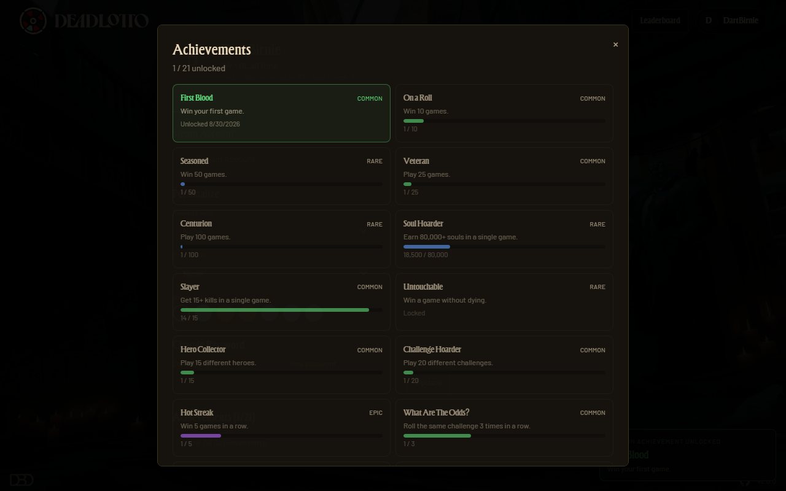
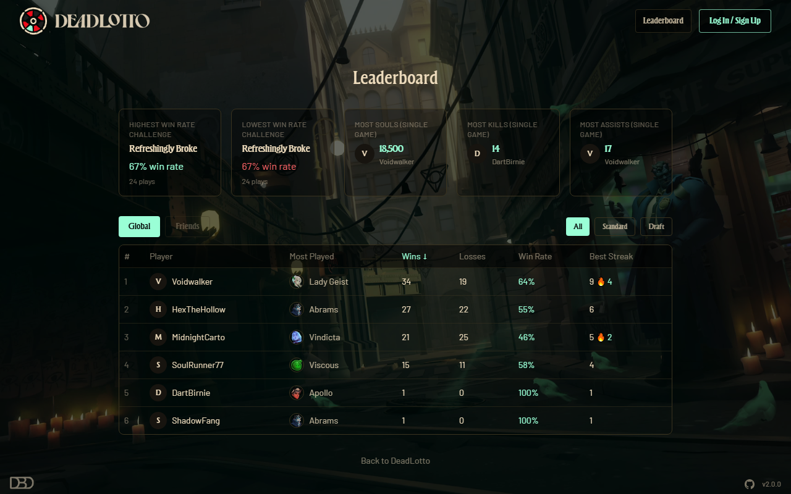

<div align="center">


**A strat-roulette companion for Valve's *Deadlock*.**

Roll a random hero. Roll a random challenge. Play the match. See if your team can pull off the run.


[](#tech-stack)

</div>

---

DeadLotto turns a normal Deadlock lobby into a run of its own. Up to six players join a shared room, each spin a
39-slot wheel (all 38 heroes plus a wildcard "your choice" slot) or draft heroes turn-by-turn from one shared pool,
get handed a random gameplay challenge on top, then actually go play the match in Deadlock while DeadLotto tracks
who's playing what. When the game ends, everyone logs kills/deaths/assists/souls and the result feeds achievements,
win streaks, and a leaderboard that's been growing every session since.

## Screenshots

<table>
<tr>
<td width="50%"></td>
<td width="50%"></td>
</tr>
<tr>
<td width="50%"></td>
<td width="50%"></td>
</tr>
<tr>
<td width="50%"></td>
<td width="50%"></td>
</tr>
<tr>
<td width="50%"></td>
<td width="50%"></td>
</tr>
</table>

## Features

**Rolling a run**
- 38 Deadlock heroes plus a wildcard "your choice" slot, spun on an animated wheel - or drafted turn-by-turn from
  one shared pool in **Draft mode**, order randomized fresh every round
- 1-3 random gameplay challenges per player (item restrictions, playstyle rules, a fully random 12-item build, and
  more), drawn from a pool the host can trim down
- Optional rerolls per player, a host-configurable hero/challenge count, and a ready-check gate so a round can't
  start until everyone's actually at their PC

**Playing together**
- Real-time shared lobbies over Socket.IO - up to 6 players, invite by code or link, invite an online friend directly
- A live team panel on the game screen shows every teammate's avatar, title, current challenge, and locked hero
- A connection banner and per-player "Reconnecting..." indicators surface dropped connections instead of silently
  booting someone mid-round; the server gives a real reconnect window before anyone's actually removed
- In-lobby chat, and a "Play Again" flow that reshuffles for a new round without leaving the lobby

**After the match**
- 21 achievements across four rarities (common → legendary) for streaks, stats, and oddities like rolling the same
  challenge three times in a row
- A global and friends-only leaderboard, filterable by Standard vs. Draft mode, tracking wins, win rate, and streaks
- A shareable, public post-game summary link (and a downloadable recap image) for the whole team's result
- Optional Discord webhook integration - post the result straight to a server channel when a game finishes
- Lifetime and per-session stats, favorite hero, and full game history on every profile

**Accounts & customization**
- Friends list with requests, online status, and rich profile pages (Steam link, accent color, profile picture)
- Unlockable titles from achievements, plus dedicated Owner/Admin titles for site staff
- Suggest-a-challenge form that emails the maintainer (or just saves to the database if SMTP isn't configured)
- A small admin panel for managing challenge suggestions, error logs, and users

## Tech stack

| | |
|---|---|
| **Client** | React 19, Vite, TypeScript, Tailwind CSS v4, React Router, Zustand |
| **Server** | Express 5, Socket.IO 4, Prisma 6, PostgreSQL, JWT auth, bcrypt |
| **Uploads** | Local disk in dev, S3-compatible storage (e.g. Cloudflare R2) in production |
| **Email** | Nodemailer (challenge suggestions) |
| **Testing** | Vitest, Testing Library |

`client/`, `server/`, and `shared/` are three separate npm projects (not a workspace) - `shared/` holds the hero
registry, challenge list, achievement definitions, and Socket.IO event contracts both sides import directly.

In production the server also serves the built client (see [Deploying to production](#deploying-to-production)) -
one process, one origin, no CORS/cross-site cookie complexity. In dev, Vite's own dev server handles the client and
proxies API/socket requests to the server.

## Getting started

```bash
npm install --prefix client
npm install --prefix server
npm run dev
```

This starts the client on http://localhost:5173 and the API/socket server on http://localhost:4000 (the client
dev server proxies `/api`, `/uploads`, and `/socket.io` to it).

The server needs a Postgres database - set `DATABASE_URL` in `server/.env` (copy `server/.env.example`), then run
`npm run prisma:migrate:dev --prefix server` to apply migrations. [Neon](https://neon.tech) has a free tier with no
card required. Uploaded profile pictures save to `server/uploads/` locally unless `S3_*` vars are set (see below).

### Email for challenge suggestions

The "Suggest a Challenge" feature always saves suggestions to the database. To actually email them, fill in
`SMTP_HOST` / `SMTP_USER` / `SMTP_PASS` in `server/.env` (copy `server/.env.example` for the full list of
variables). Without those set, the server logs a warning and skips sending - nothing breaks.

### Avatar uploads

Profile pictures save to `server/uploads/` on local disk by default - fine for dev. Set the `S3_*` vars in
`server/.env` (see `.env.example`) to switch to an S3-compatible bucket (e.g. Cloudflare R2) instead; needed for
any deploy with more than one server instance or where the local filesystem isn't durable across redeploys.

## Project structure

```
client/   React + Vite + TypeScript + Tailwind SPA
server/   Express + Socket.IO + Prisma API and realtime server
shared/   Hero registry, challenge list, achievement defs, socket event contracts
```

## Deploying to production

The app runs as a single always-on Node process - no serverless/edge functions, since WebSockets need a persistent
connection and Prisma needs a live process.

From the repo root:

- `npm run build` - installs and builds both `client/` and `server/`, then copies `client/dist` into `server/public`
  so the server can serve it directly.
- `npm run start` - applies any pending Prisma migrations (`prisma migrate deploy`), then starts the server
  (`node server/dist/server/src/index.js`), which serves the API, Socket.IO, and the built client all on one port.

Required env vars (set in the host's environment, not committed) - see `server/.env.example` for the full list:

- `DATABASE_URL` - Postgres connection string (e.g. from [Neon](https://neon.tech))
- `JWT_SECRET` - a real random secret, not the dev placeholder
- `CLIENT_ORIGIN` - the deployed URL itself, e.g. `https://deadlotto.com`
- `S3_*` - Cloudflare R2 (or any S3-compatible bucket) for avatar uploads
- `SMTP_*` / `EMAIL_FROM` - e.g. [Resend](https://resend.com), for challenge-suggestion emails
- `PORT` - most hosts set this automatically; the server reads it if present, otherwise defaults to 4000

Any host that runs `npm run build` then `npm run start` as persistent commands (not serverless functions) works -
Railway and Fly.io both fit with minimal config. Point your domain at the host and enable HTTPS (most platforms
provision this automatically for a custom domain).

## Hero art

`client/public/assets/heroIcons`, `heroBackgrounds`, and `heroNames` hold the per-hero art. `shared/heroRegistry.ts`
is the single place that maps each of the 38 heroes to its icon/background/name-svg files - see the comment at the
top of that file for notes on a few backgrounds that were matched by visual theme rather than an exact filename
match, in case any need correcting.

---

<div align="center">
<sub>Built by <a href="https://dartbirnie.dev">Dart Birnie</a></sub>
</div>
